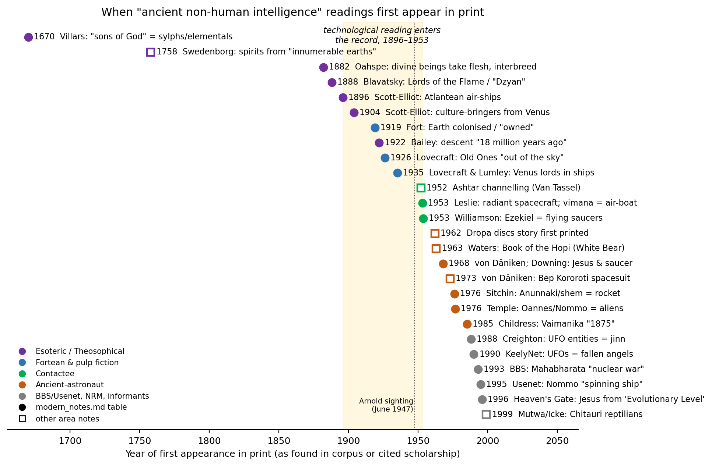
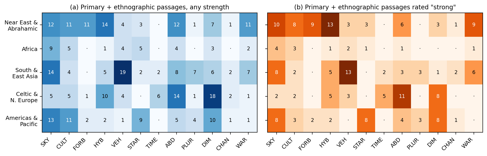

+++
title = "visitors from above? what the world's sacred texts actually say about non-human intelligences"
date = 2026-09-27
authors = ["Douglas"]
[taxonomies]

[extra]
+++

💡 _This was an exercise in AI-assisted research: a team of AI research agents indexed [sacred-texts.com](https://sacred-texts.com/) and [Biblioteca Pleyades](https://www.bibliotecapleyades.net/), close-read the relevant texts, verified every quotation by script against its source, and compiled the result into a 47-page paper. Take it with the usual caution, and open an issue on GitHub if you find any errors._

---

**Do the world's religions and myths preserve memories of contact with beings from the sky, the stars, other planets or "other dimensions"? I tried to answer that by reading the sources instead of cherry-picking them.**

## where this started

The question was simple and very old: do the world's religions and myths preserve memories of contact with beings from the sky, the stars, other planets or "other dimensions"? This is the claim behind a whole shelf of popular books, from *Chariots of the Gods?* to *The 12th Planet* and *The Sirius Mystery*. It is usually argued by quoting a few striking passages: Ezekiel's wheels, the Watchers of Enoch, the flying *vimānas* of the Indian epics, the Dogon star lore.

We wanted to do the opposite of cherry-picking. We would read as much of the primary material as we could, code what it says, check every quotation against its source, and only then ask what explains the pattern.

The starting point was the **African section of the Internet Sacred Text Archive** ([sacred-texts.com/afr](https://sacred-texts.com/afr/index.htm)). It turned out to be a revealing place to begin. Its 29 books are not "African scriptures". They are one medieval Ethiopian epic (the *Kebra Nagast*), a set of colonial-era ethnographies and folklore collections made by missionaries and officials between 1868 and 1940, and some diaspora and Rastafarian writing. The famous Dogon "Sirius" material is not there at all. That discovery set the tone for the project: before asking what a tradition says, you have to ask who wrote it down, when, and why.

## how the research was organised

**1. Indexing.** We first mapped the whole sacred-texts site. That meant 77 top-level categories and 261 entries, each rated for relevance and tagged with twelve motif codes: sky descent, culture-bringer, forbidden knowledge, hybrid offspring, celestial vehicles, star-people, time dilation, abduction or otherworld journey, plurality of worlds, hidden peoples or "other dimensions", channelled contact, and war among sky beings. Twenty-two categories (among them Sikhism, the Confucian canon, alchemy and Tarot) had nothing relevant. 

**2. Gap-filling from Biblioteca Pleyades.** Sacred-texts has big holes. It has no Dogon ethnography, no *Vaimānika Śāstra*, no full *Popol Vuh*, no Qumran Book of Giants, and nothing Korean. We filled what we could from the aggregator [bibliotecapleyades.net](https://www.bibliotecapleyades.net/), which we indexed separately (166 items). It is overwhelmingly fringe (101 of the 166 items). We used it strictly as an access copy. Whenever a page reproduced a published work, we cite the original publication. We flagged the places where the aggregator's copies are unattributed, mislabelled (Korean myths filed under "China"), altered, or contain editorial insertions.

**3. Six regional workstreams.** Close reading was split into six areas:
- the ancient Near East and Abrahamic traditions;
- Africa;
- South and East Asia;
- Celtic and Northern Europe;
- the Americas and the Pacific;
- modern esoteric and UFO literature, read as *reception* rather than as evidence about antiquity.

Each workstream produced a file of passages, an analytic essay, and a bibliography.

**4. Verification.** Every quotation, 314 in all, was checked by script against the fetched page text. Each passage records the translator and date, the URL and locator, the motif codes, a source type and a strength rating. The source types are primary text, ethnographic record, secondary scholarship, fringe/esoteric, and critical scholarship. Quotations in the paper were inserted mechanically from the verified corpus, so none of them can drift from its source.

**5. Five hypotheses, none assumed.** For every motif we asked which of five explanations fits best:
- **H1:** literal contact;
- **H2:** cultural diffusion and literary borrowing;
- **H3:** shared cognitive and structural myth-making;
- **H4:** translation and editorial artefacts;
- **H5:** modern reinterpretation.

We were explicit from the start that **texts cannot prove or disprove literal contact**. What they can show is whether the motifs, as actually attested, *require* it.

## what we found

### the motifs are real and often ancient

This needs saying first, because debunking sometimes forgets it. The world's literatures really are full of non-human intelligences who come down from the sky and interact with people:
- the Watchers of 1 Enoch, who descend on Mount Hermon, father giants and teach metallurgy and astrology;
- the Yoruba gods who climb down a chain from Heaven to make land at Ife;
- the tailed sky-race from which a Chaga clan claims descent;
- Indra's chariot and Rāvaṇa's Pushpaka;
- Ninigi descending from the High Plain of Heaven to found Japan's imperial line;
- the Irish *síd*-folk who take new mothers to nurse their children;
- the Iroquoian "man-beings" who live beyond the visible sky.

Sky descent, culture-bringers, divine–human unions, otherworld journeys and hidden peoples turn up in every region we studied.

### but the details don't look like spacecraft

When you line the passages up, several patterns stand out.

- **No traditional text names a planet of origin.** "Heaven" is a roof, a court or a layer of the cosmos, not a place in space. Stars are persons (Cherokee, /Xam, Ojibwa), angels (1 Enoch), or humans transformed (Pleiades myths on three continents). The one explicit "from the stars" teacher, the Acjachemen Chinigchinich, was recorded by a Franciscan friar in the 1820s and may belong to an early-contact revival movement. A 1909 Irish informant's idea that the fairies "came from the planets" was, in his own words, "according to my idea".
- **Every vehicle is divine, magical, visionary or human-made.** Examples:
  - The *Kebra Nagast*'s wagons are lifted "a cubit" by the Archangel Michael.
  - Indian flying cities vanish "like a cloud-constructed city".
  - Ezekiel's wheels are explicitly a "likeness".
  - The only premodern technical flying machine, King Bhoja's 11th-century mercury-heated wooden bird, is a human automaton.

  The celebrated *Vaimānika Śāstra* was dictated in the 20th century (1918–23, or 1903–18 on a rival account). Engineers at the Indian Institute of Science found its craft unworkable in 1974.
- **Forbidden knowledge from heaven is one tradition, not a universal.** The Watchers' illicit teaching is Mesopotamian sage lore inverted by Second Temple Jewish writers. From there it passed to Ethiopia, Manichaeism and Islam (Hārūt and Mārūt "at Babylon"). Outside that chain, the nearest case, in the *Popol Vuh*, runs the other way: the gods *withdraw* knowledge from the first humans.
- **Time dilation is strong but regional.** It is Celtic (Bran becomes "a heap of ashes"; Oisín ages the moment he touches the ground), Indian (King Raivata waits a "moment" in Brahmā's court while ages pass), and later Japanese (Urashima). 2 Enoch's sixty days in heaven equal sixty days on earth.
- **Channelled contact is modern.** The only traditional "contactee" we found is a Cherokee story about a man who fakes messages from star spirits and gets caught.

### the "ancient astronaut" reading has a birth date

The most striking result came from the modern workstream. Almost every popular "ancient NHI" reading has a **datable first appearance in print**, and most of them have a documented chain of borrowing. The clearest chain is the "Venus lineage":

- **Blavatsky (1888):** spiritual "Lords of the Flame" incarnate in early humanity. There are no ships.
- **Scott-Elliot (1904) and Leadbeater (1912):** these beings come from Venus.
- **Bailey (1922):** she dates their descent to "eighteen million years ago". She never actually names Venus.
- **A Lovecraft revision (written 1935):** "the lords of Venus came through space in their ships".
- **Desmond Leslie (1953), in *Flying Saucers Have Landed*:** he turns the Theosophical descent into "a huge, shining, radiant vessel", citing only Theosophists. The same book introduces Adamski's Venusian contact.

The same pattern holds elsewhere:
- **Atlantean air-ships** first appear in Scott-Elliot in 1896.
- **Vimāna = aircraft:** Leslie, 1953.
- **Ezekiel as a flying saucer:** Williamson, 1953.
- **The Mahābhārata "nuclear war" verse:** manufactured in a 1993 bulletin-board file. The real passage has a curse-born iron bolt.
- **The spacesuited Kayapó hero Bep Kororoti:** von Däniken, 1973. The 1960 field text is a storm myth.

Taken together, the **technological reading of ancient beings enters the record between 1896 and 1953**. It comes through Theosophy, pulp fiction and the contactees, not through the traditions themselves (see the timeline below, Figure 5 in the paper).

Counting motifs makes this visible. In the traditional primary and ethnographic passages, the commonest motifs are sky descent, hidden peoples and otherworld journeys. In the fringe passages, vehicles and sky descent dominate, and time dilation disappears altogether. The modern reading doesn't just reinterpret the old motifs. It *reweights* them.

### surprising findings along the way

- **The Dogon "Sirius B" mystery dissolves under restudy.** The 1950 article describes the companion star "twinkling", which would make it visible, and Sirius B is not. Walter van Beek's decade of fieldwork found that no Dogon outside Griaule's informant circle knew the doctrine. The article itself never claims contact. That idea is Robert Temple's (1976).
- **A /Xam control case.** Detailed 1870s Sirius lore from southern Africa, in which Sirius should "twinkle like Canopus", has no companion star and no visitors.
- **Credo Mutwa's reptilian "Chitauri".** They appear in no 19th-century Zulu source. Mutwa turned the *imbulu* of a folktale, which Theal in 1886 described as a tailed shape-shifter "believed in by little folks", into a reptilian alien in an interview arranged through David Icke.
- **Editors leave fingerprints.**
  - A 1926 editor footnoted 2 Enoch's solar chariot "Cf. 'Rapid Transit.'"
  - The online text of the Kayapó "space hero" story contains an editor's interjection, "(or the future? - Red.)", inside supposedly indigenous speech.
  - Mary Kingsley noticed in 1898 that a Kongo spirit was credited with teaching crops that Roman Catholic missionaries had introduced in 1490. This is a perfect demonstration that culture-bringer myths update themselves.
- **Vallée's quotation may not match his source.** Evans-Wentz (1911) wrote that a Barra tale "suggests" fairy women resemble succubi. The online text of *Passport to Magonia* has "proves conclusively". This needs checking against the 1969 print.

## so what's left?

No passage we found *requires* literal contact. The most "visitor-like" candidate is a white being who "descended from above in a fog" in Callaway's 1868–70 Zulu texts. It has simpler readings, including a mythologised memory of early European contact. But an honest summary shouldn't stop at "debunked". Some things remain genuinely interesting:

- **The otherworld taking is everywhere:**
  - the Rwandan Thunder's bride;
  - Enoch's summons;
  - Raivata's visit to Brahmā;
  - Bran and Oisín;
  - the fairy-taken nurse;
  - the Star Husband's wives.

  Diffusion explains local clusters, but not the whole map.
- **The supernatural lapse of time** appears early and far apart: Ireland by the 7th–8th century, India in the first millennium CE, Japan in the 8th century. Nobody has yet done a proper phylogenetic tale-type study of it.
- **Bullard's puzzle.** The folklorist Thomas Bullard found modern abduction reports *more* uniform than oral folklore ought to be. Whether hypnotic regression and investigator filtering explain that uniformity is an empirical question that could be tested.

## limitations

The study is textual and English-language. It rests heavily on Victorian translations and on ethnographies collected under colonial conditions, and it did no fieldwork. Sacred-texts has an Anglo-Celtic and Theosophical skew and is thin on Africa, China and living oral traditions. The aggregator copies of Sitchin, Temple, Leslie and Vallée must be checked against print. Some bibliography entries are flagged "verify", and we have not filled in missing details. The motif counts describe the *shape* of our sample, not how often motifs occur in whole traditions.

## next steps

1. Check the flagged quotations against print editions: Vallée 1969, Leslie 1953, Dalley, the Genesis Apocryphon, and the Korean texts.
2. Re-read key passages in modern critical editions: Nickelsburg/VanderKam for 1 Enoch, ETCSL for Sumerian, Tedlock for the *Popol Vuh*, and a Ge'ez check of the *Kebra Nagast*'s "air (or winds)".
3. Close the gaps: Chinese primary texts (Shanhaijing, Chuci), Sahagún and the Anales de Cuauhtitlan for Quetzalcoatl, Griaule's *Dieu d'eau*, and Mutwa's 1964 *Indaba, My Children* (to see whether "Chitauri" predates 1990).
4. Run a phylogenetic tale-type analysis of the otherworld time-lapse motif.
5. Quantitatively compare the variability of fairy legends with abduction reports, to test Bullard's uniformity argument.

---

You can access the rendered PDF file and the original LaTeX source below:

- [Read the PDF](visitors-from-above.pdf)
- [Browse the LaTeX source](https://github.com/douglops/blog/tree/main/content/visitors-from-above/visitors-from-above.tex) and its [bibliography](https://github.com/douglops/blog/tree/main/content/visitors-from-above/references.bib)
- [Download the full research package](visitors-from-above.zip) (zip, 1.3 MB): the paper, LaTeX source, bibliography, figures and evidence corpus
